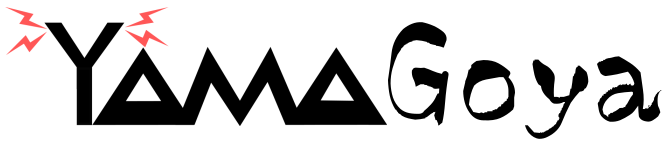
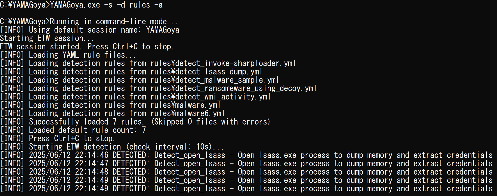
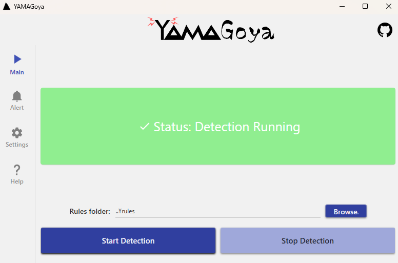
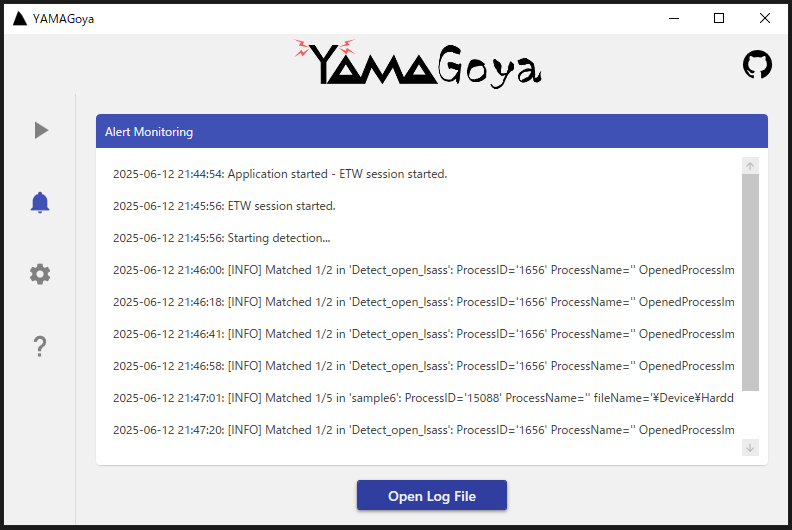

<div align="center"></div> 

## Concept

**YAMAGoya** (Yet Another Memory Analyzer for malware detection and Guarding Operations with YARA and Sigma) is a C# application that leverages [Event Tracing for Windows (ETW)](https://learn.microsoft.com/en-us/windows/win32/etw/event-tracing-portal) to capture real-time system events. It applies detection rules written in YAML format (for custom correlation logic) and can also parse **Sigma** rules for standardized threat detection. In addition, it supports in-memory scanning using **YARA** to detect fileless or stealth malware.

The tool runs entirely in **userland**, avoiding kernel-mode dependencies and simplifying integration with community-based signatures.

**[日本語版README](README_jp.md)**

## Table of Contents
- [Features](#features)
- [Download Binary Version](#download-binary-version)
- [Build and Installation](#build-and-installation)
  - [Prerequisites](#prerequisites)
  - [Command-Line Build](#command-line-build)
- [How to Use](#how-to-use)
  - [Command-Line](#command-line)
  - [GUI Usage](#gui-usage)
- [Examples for Command-Line](#examples-for-command-line)
  - [Starting an ETW Session](#starting-an-etw-session)
  - [Stopping an ETW Session](#stopping-an-etw-session)
  - [Applying Detection Rules (YAML)](#applying-detection-rules-yaml)
  - [Applying Detection Rules (Sigma)](#applying-detection-rules-sigma)
  - [Enabling Memory Scanning](#enabling-memory-scanning)
  - [Monitoring Specific Event Types](#monitoring-specific-event-types)
  - [Logging Configuration](#logging-configuration)
  - [Advanced Configurations](#advanced-configurations)
  - [All-in-One Example](#all-in-one-example)
- [Creating YAML Rule Files](#creating-yaml-rule-files)
- [Sigma Support](#sigma-support)
  - [Supported Sigma Categories](#supported-sigma-categories)
  - [Sigma to ETW Mapping](#sigma-to-etw-mapping)
- [Configuration and Logs](#configuration-and-logs)
- [Known Limitations / Caveats](#known-limitations--caveats)
- [License](#license)
- [FAQ (Frequently Asked Questions)](#faq-frequently-asked-questions)

---

## Features

- **Userland-Only**  
  No kernel drivers are required, ensuring minimal OS risk and simpler deployment.

- **Real-Time Monitoring**  
  Utilizes ETW to monitor file I/O, process creation/termination, registry events, DNS queries, network traffic, PowerShell scripts, and more.

- **Multi-Format Detection Rules**  
  - **YAML**: Allows correlating multiple event types using regex or other matching logic.  
  - **Sigma**: Parses and applies Sigma rules for community-driven threat detection.

- **Memory Scanning with YARA**  
  Scans system memory using YARA rules to detect fileless or stealth malware.

- **GUI / CLI Interfaces**  
  Run via command-line or launch the GUI.

---

## Download Binary Version

Download compiled versions from [Release](https://github.com/JPCERTCC/YAMAGoya/releases).

---

## Build and Installation

### Prerequisites

- **.NET 6.0 or Later**  
  Install the appropriate .NET SDK or runtime.
- **NuGet Packages** 
  - [Microsoft.Diagnostics.Tracing.TraceEvent](https://www.nuget.org/packages/Microsoft.Diagnostics.Tracing.TraceEvent/)  
  - [YamlDotNet](https://www.nuget.org/packages/YamlDotNet/)  
  - [System.Diagnostics.EventLog](https://www.nuget.org/packages/System.Diagnostics.EventLog/)  
  - [MaterialDesignColors](https://www.nuget.org/packages/MaterialDesignColors/)  
  - [MaterialDesignThemes](https://www.nuget.org/packages/MaterialDesignThemes/)
  - [Antlr4.Runtime.Standard](https://www.nuget.org/packages/Antlr4.Runtime.Standard/)
  - [DynamicExpresso.Core](https://www.nuget.org/packages/DynamicExpresso.Core/)

### Command-Line Build

0. Install NuGet Packages:
   ```bash
   dotnet add package Microsoft.Diagnostics.Tracing.TraceEvent
   dotnet add package YamlDotNet
   dotnet add package System.Diagnostics.EventLog
   dotnet add package MaterialDesignThemes
   dotnet add package MaterialDesignColors
   dotnet add package Antlr4.Runtime.Standard
   dotnet add package DynamicExpresso.Core
   ```

1. **Clone** the repository:
   ```bash
   git clone https://github.com/JPCERTCC/YAMAGoya.git
   cd YAMAGoya
   ```
2. **Build**:
   ```bash
   dotnet build
   ```
3. (Optional) **Publish** a self-contained application:
   ```bash
   dotnet publish -c Release -r win-x64 -p:PublishTrimmed=false -o out
   ```

---

## How to Use

### Command-Line

#### Basic Usage

```bash
YAMAGoya.exe [options]
```

**Step 1: Prepare Your Environment**
1. Ensure you have Administrator privileges (required for ETW session management)
2. Prepare your detection rules:
   - For YAML rules: Create `.yaml` or `.yml` files in a folder
   - For Sigma rules: Place `.yml` Sigma rule files in a folder  
   - For YARA rules: Create `.yar` or `.yara` files in a folder

**Step 2: Start Session and Detection (Choose one method)**
```bash
# Method A: Sigma rules with comprehensive monitoring
YAMAGoya.exe --session --sigma "C:\Rules\Sigma" --all

# Method B: YARA memory scanning
YAMAGoya.exe --session --yara "C:\Rules\YARA" --all
```

**Step 3: Configure Advanced Options (Optional)**
```bash
# Enable automatic process termination and verbose logging
YAMAGoya.exe --session --detect "C:\Rules" --all --kill --verbose

# Custom logging configuration
YAMAGoya.exe --session --detect "C:\Rules" --all --log_path "D:\SecurityLogs" --no_event_log

# Set rule check interval to 30 seconds
YAMAGoya.exe --session --detect "C:\Rules" --all --check_interval 30
```

**Step 4: Stop Monitoring**
```bash
# Stop the ETW session
YAMAGoya.exe --stop
```

#### Command-Line Options Reference

| Option                          | Description                                                                 |
|---------------------------------|-----------------------------------------------------------------------------|
| `--help, -h`                    | Show help message and exit.                                                 |
| `--session, -s`                 | Start an ETW session named `"YAMAGoya"` (stops any existing session first). |
| `--stop, -x`                    | Stop the active `"YAMAGoya"` ETW session.                                   |
| `--detect, -d <folder>`         | Load detection rules (YAML) from `<folder>` and start detection.            |
| `--sigma, -si <folder>`         | Load and apply Sigma rules from `<folder>` instead of YAML rules.           |
| `--yara, -y <folder>`           | Load and apply YARA rules from `<folder>` for memory scanning.              |
| `--all, -a`                     | Enable monitoring for all event categories.                                 |
| `--file, -f`                    | Monitor file **creation** events.                                           |
| `--delfile, -df`                | Monitor file **deletion** events.                                           |
| `--process, -p`                 | Monitor process creation and termination events.                            |
| `--load, -l`                    | Monitor DLL load events.                                                    |
| `--registry, -r`                | Monitor registry key/value creation and modification events.                |
| `--open, -o`                    | Monitor process open events.                                                |
| `--dns, -n`                     | Monitor DNS queries and responses.                                          |
| `--ipv4, -i4`                   | Monitor IPv4 network traffic events.                                        |
| `--ipv6, -i6`                   | Monitor IPv6 network traffic events.                                        |
| `--powershell, -ps1`            | Monitor PowerShell script block executions.                                 |
| `--shell, -sh`                  | Monitor shell events (e.g., RunKey, shortcuts).                             |
| `--wmi, -w`                     | Monitor WMI command execution events.                                       |
| `--kill, -k`                    | Automatically terminate detected malicious processes.                       |
| `--session_name <name>`         | Set a custom name for the ETW session.                                      |
| `--no_text_log`                 | Disable logging to text files.                                              |
| `--no_event_log`                | Disable logging to Windows Event Log.                                       |
| `--check_interval <seconds>`    | Set the time interval (seconds) for rule correlation checks.                |
| `--log_path <path>`             | Set custom directory path for log files.                                    |
| `--verbose`                     | Enable verbose logging to the console.                                      |

  <div align="center"></div>
  
### GUI Usage

1. Run `YAMAGoya.exe` with no arguments (or double-click the executable) to launch the GUI.
2. The GUI provides a user-friendly interface with four main tabs:

#### Main Tab
- **Session Status Display**: Shows current ETW session status with color-coded indicators
- **Rules Folder Selection**: Browse and select the folder containing your detection rules
- **Start/Stop Detection**: Large buttons to begin and end monitoring operations

#### Alert Monitoring Tab
- **Real-time Alert Display**: Live monitoring of security alerts with timestamps
- **Color-coded Alerts**: Detected threats are highlighted in red for immediate attention
- **Log File Access**: Quick access to open the current log file

#### Settings Tab
Configure advanced detection options:
- **Kill Process Mode**: Automatically terminate detected malicious processes
- **Rule Format Selection**: 
  - Use Sigma rules (standardized threat detection)
  - Use custom YAML rules (custom correlation logic)
- **YARA Memory Scanning**: Enable memory scanning with configurable interval (default: 1 hour)
- **Logging Configuration**:
  - Event Log: Save alerts to Windows Event Log
  - Text Log: Save alerts to text files with custom directory path
- **Custom ETW Session Name**: Set an ETW session name (default: YAMAGoya)

#### Help Tab

  <div align="center"></div>

  <div align="center"></div>
  
---

## Examples for Command-Line

### Starting an ETW Session

```bash
YAMAGoya.exe --session
```

### Stopping an ETW Session

```bash
YAMAGoya.exe --stop
```

### Applying Detection Rules (YAML)

```bash
YAMAGoya.exe --session --detect .\rules --all --kill --verbose
```

### Applying Detection Rules (Sigma)

```bash
YAMAGoya.exe --session --sigma C:\sigma_rules --all
```

### Enabling Memory Scanning

```bash
YAMAGoya.exe --session --yara .\yara_rules --all
```

### Monitoring Specific Event Types

```bash
# Monitor process creation and termination
YAMAGoya.exe --session --detect .\rules --process --verbose

# Monitor DNS queries
YAMAGoya.exe --session --detect .\rules --dns --verbose

# Monitor PowerShell script execution
YAMAGoya.exe --session --detect .\rules --powershell --verbose

# Monitor WMI command execution
YAMAGoya.exe --session --detect .\rules --wmi --verbose

# Monitor shell events (e.g., RunKey, shortcuts)
YAMAGoya.exe --session --detect .\rules --shell --verbose

# Monitor network activities
YAMAGoya.exe --session --detect .\rules --ipv4 --ipv6 --verbose

# Monitor file and registry operations
YAMAGoya.exe --session --detect .\rules --file --delfile --registry --verbose
```

### Logging Configuration

```bash
# Disable text log files but keep Windows Event Log
YAMAGoya.exe --session --detect .\rules --all --no_text_log

# Disable Windows Event Log but keep text log files
YAMAGoya.exe --session --detect .\rules --all --no_event_log

# Set custom log file path
YAMAGoya.exe --session --detect .\rules --all --log_path "D:\Logs\YAMAGoya"
```

### Advanced Configurations

```bash
# Custom ETW session name
YAMAGoya.exe --session --session_name "ForensicSession" --detect .\rules --all

# Set rule check interval to 15 seconds
YAMAGoya.exe --session --detect .\rules --all --check_interval 15

# Combined monitoring with custom session name and automatic process termination
YAMAGoya.exe --session --session_name "ThreatHunting" --detect .\rules --process --registry --file --kill
```

### All-in-One Example

```bash
# Comprehensive monitoring with all options
YAMAGoya.exe --session --session_name "ComprehensiveMonitoring" --detect .\rules --all --kill --verbose --check_interval 30 --log_path "C:\Logs\YAMAGoya"
```

---

## Sigma Support

YAMAGoya implements support for [Sigma](https://github.com/SigmaHQ/sigma), a generic signature format for describing detection rules. Sigma rules can be used instead of YAMAGoya's custom YAML rules by using the `--sigma` or `-si` command-line option.

### Supported Sigma Categories

The following table shows which Sigma rule categories are currently supported by YAMAGoya:

| Sigma Category | Supported | 
|----------------|:---------:|
| create_remote_thread | ✓ |
| create_stream_hash | - |
| dns_query | ✓ |
| driver_load | - |
| file_access | ✓ |
| file_block | - |
| file_change | - |
| file_delete | ✓ |
| file_event | ✓ |
| file_rename | - |
| image_load | ✓ |
| network_connection | ✓ |
| pipe_created | - |
| ps_classic_provider_start | - |
| ps_classic_start | - |
| ps_module | - |
| ps_script | ✓ |
| process_access | ✓ |
| process_creation | ✓ |
| process_tampering | - |
| raw_access_thread | - |
| registry_add | ✓ |
| registry_delete | ✓ |
| registry_event | ✓ |
| registry_set | ✓ |
| sysmon_error | - |
| sysmon_status | - |
| system | - |
| wmi_event | ✓ |
| webserver | - |

### Sigma to ETW Mapping

YAMAGoya translates Sigma categories to the appropriate ETW providers and event IDs. Here's how the supported categories are mapped:

| Sigma Category | ETW Provider | Event IDs |
|----------------|--------------|-----------|
| create_remote_thread | Microsoft-Windows-Kernel-Audit-API-Calls | 5 |
| dns_query | Microsoft-Windows-DNS-Client | 3000-3020 |
| file_access | Microsoft-Windows-Kernel-File | 10, 12, 30 |
| file_event | Microsoft-Windows-Kernel-File | 10, 11, 12, 30 |
| file_delete | Microsoft-Windows-Kernel-File | 11 |
| image_load | Microsoft-Windows-Kernel-Process | 5 |
| network_connection | Microsoft-Windows-Kernel-Network | 1-16, 18, 42, 43 |
| ps_script | Microsoft-Windows-PowerShell | 4104 |
| process_access | Microsoft-Windows-Kernel-Process | 1 |
| process_creation | Microsoft-Windows-Kernel-Process | 1 |
| registry_add | Microsoft-Windows-Kernel-Registry | 1 |
| registry_delete | Microsoft-Windows-Kernel-Registry | 3, 6 |
| registry_event | Microsoft-Windows-Kernel-Registry | 1-7 |
| registry_set | Microsoft-Windows-Kernel-Registry | 5 |
| wmi_event | Microsoft-Windows-WMI-Activity | 1-50 |

---

## Creating YAML Rule Files

To create a detection rule in YAML format, follow the schema below. Each rule file should include:

- **rulename**: A unique name for the rule.
- **description**: A brief description of what the rule detects.
- **rules**: A list of rule items. Each item must include:
  - **ruletype**: The type of rule (e.g., `regex`, `binary`, etc.).
  - **target**: The event category to match. Valid targets include:
    - **file**: File creation events.
    - **delfile**: File deletion events.
    - **process**: Process events.
    - **open** : OpenProcess.
    - **load**: DLL load events.
    - **registry**: Registry events.
    - **dns**: DNS events.
    - **ipv4**: IPv4 network events.
    - **ipv6**: IPv6 network events.
    - **shell**: Shell-related events (RunKey, shortcuts).
    - **powershell**: PowerShell execution events.
    - **wmi**: WMI command execution events.
  - **rule**: The pattern or value to match (for regex rules, a valid regular expression).

Example YAML rule file:

```yaml
rulename: "MalwareExecutionDetection"
description: "Detects suspicious malware execution patterns."
rules:
  - ruletype: "regex"
    target: "process"
    rule: "^malicious_exe\\.exe$"
  - ruletype: "regex"
    target: "file"
    rule: ".*\\.(exe|dll)$"
  - ruletype: "binary"
    target: "file"
    rule: "2E 65 78 65"
```

**Steps:**

1. Create a new file with a `.yaml` or `.yml` extension.
2. Copy and customize the sample structure.
3. Save the file in your designated rules folder.

---

## Configuration

- **`Config.cs`**:  
  - `sessionName`: Default ETW session name  
  - `isTextLog` and `logDirectory`: Enable text logging and specify the log directory
  - `logDateFormat`: Date format string used in log file names (default: "yyyy-MM-dd")
  - `logFileNameFormat`: Naming pattern for log files (default: "yamagoya_{0}.log")
  - `isEventLog` and `eventLogSource`: Enable Windows Event Log logging and set the source name
  - `checkInterval`: Time interval (in seconds) used for rule correlation and state resetting for custom YAML rules
  - `memoryScanInterval`: Time interval (in hours) for YARA memory scanning operations
  - `logLevel`: Controls verbosity of logging (Debug, Info, Warning, Error)

- **System Tray**:
  - Minimizing the application sends it to the system tray
  - Double-click the tray icon to restore the window
  - Right-click the tray icon for a context menu with Open and Exit options

---

## Known Limitations / Caveats

1. **Elevated Privileges**: Administrator rights are necessary for managing ETW sessions, writing to the Windows Event Log, terminating processes, etc.
2. **Performance Overhead**: Monitoring multiple providers or high event volumes may result in significant log output; adjust your rules accordingly.
3. **ETW Bypass**: Advanced malware may bypass userland detection methods. Consider complementing with kernel-level or network-based solutions.
4. **Sigma Category Support**: Not all Sigma categories are currently supported. See the [Supported Sigma Categories](#supported-sigma-categories) section for details.

---

## License

See the [LICENSE](LICENSE.txt) file for details.

---

## FAQ (Frequently Asked Questions)

### General Questions

**Q: What types of malware can YAMAGoya detect?**  
A: YAMAGoya can detect a wide range of malware including fileless malware, remote access trojans, backdoors, and other malicious software that exhibits suspicious behavior traceable through ETW events. The detection scope depends on the rules you configure. However, by default, no rules are set in YAMAGoya to detect it, so you need to prepare Sigma or YARA rules.

**Q: Does running YAMAGoya impact system performance?**  
A: YAMAGoya is designed to minimize performance impact, but monitoring multiple ETW providers simultaneously can consume system resources. For optimal performance with minimal overhead, consider enabling only the necessary event categories for your use case.

**Q: Can YAMAGoya replace my antivirus software?**  
A: No, YAMAGoya is intended as a complementary tool for advanced threat detection and analysis. It works best alongside traditional antivirus solutions as part of a defense-in-depth strategy.

### Technical Questions

**Q: I'm getting "Failed to start the ETW session" errors when starting an ETW session. What should I do?**  
A: YAMAGoya requires administrative privileges to manage ETW sessions. Make sure to run the application as an administrator (right-click → Run as administrator).

**Q: How do I minimize false positives?**  
A: Tune your rules carefully and iteratively. Start with more specific patterns, test in your environment, and gradually refine rules. For Sigma rules, consider adjusting the confidence or severity thresholds to match your risk tolerance.

**Q: What's the difference between YAML and Sigma rule formats?**  
A: YAMAGoya's custom YAML rules allow for flexible event correlation across different ETW providers. 

**Q: Where can I find sample rules to get started?**  
A: The [Sigma GitHub repository](https://github.com/SigmaHQ/sigma) and [YARA rule GitHub repositories](https://github.com/InQuest/awesome-yara?#rules) offer extensive collections of community-maintained rules.

**Q: How frequently should I scan with YARA rules?**  
A: The default scan interval is 1 hour, which balances detection effectiveness with system performance. Adjust based on your security requirements and system capacity. High-risk environments might benefit from more frequent scanning.
